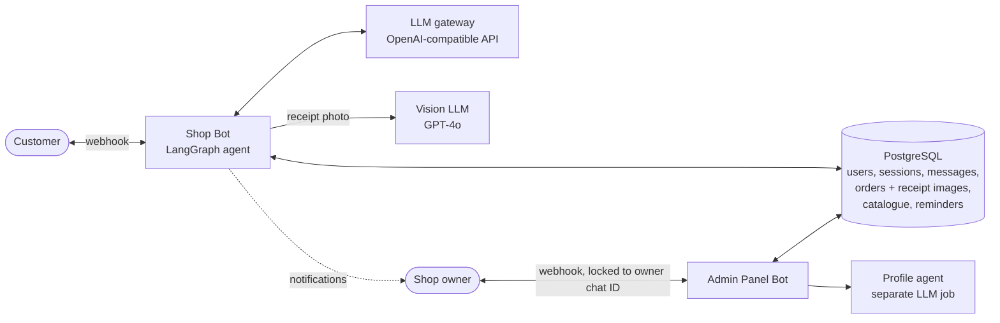
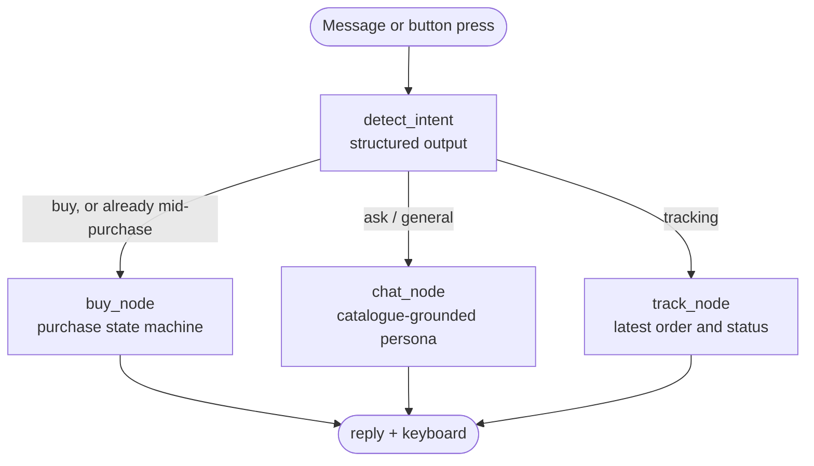
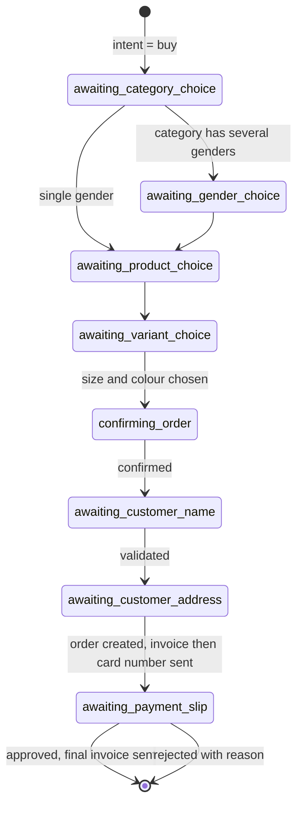
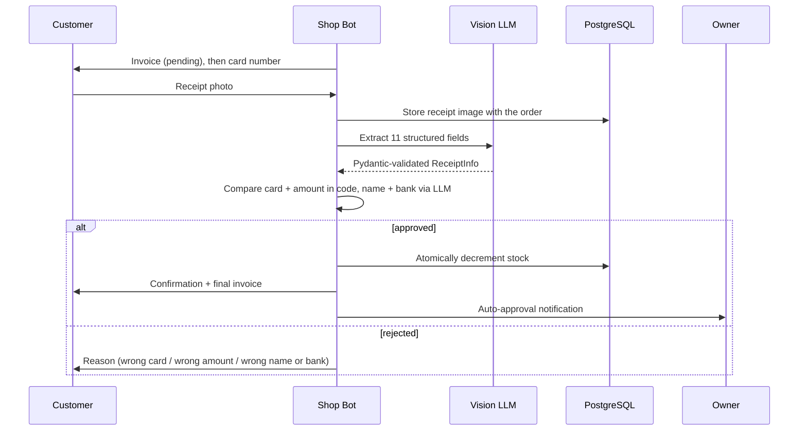

<div align="center">

# 🛍️ AI Sales Agent: 24/7 Telegram Seller + Owner Intelligence Panel

### An LLM agent that takes a customer from the first "hi" to a **verified bank-receipt payment and a final invoice**, plus a second bot that gives the shop owner sales reports, inventory and **AI-analyzed customer profiles**.


**[🌐 Showcase site + 2 full demo videos](https://company.chatbotsupport.ir/)** ·
**[🏗️ Architecture](#%EF%B8%8F-architecture)** ·
**[🔐 Payment verification](#-payment-verification-pipeline)** ·
**[🛠️ Admin panel](#%EF%B8%8F-admin-panel-bot)** ·
**[👤 Author](#-about-the-author)**

</div>

---

## ⚡ TL;DR

| | |
|---|---|
| **What it is** | Two production Telegram bots sharing one PostgreSQL database: a **customer-facing sales agent** and an **owner-facing management panel** |
| **Sales agent** | Detects intent → guides category/product/size/colour selection with buttons → collects name and address → issues an invoice → **reads the payment receipt photo with a vision LLM and verifies it** → confirms with a final invoice (order code, bank tracking number, delivery window) |
| **Admin panel** | Sales report, live inventory, paginated customer directory with receipts, **chat history exported as a Persian PDF**, and a **cached AI behavioural profile** per customer |
| **Core idea** | The LLM handles *language and perception*. **Deterministic code owns every fact that involves money**: prices, invoices, stock, card numbers and amounts |
| **Status** | ✅ Deployed on a Python PaaS (webhook mode), stable, used by real users. Not a notebook demo |

> **The engineering thesis:** LLMs are excellent at understanding people and unreliable at executing a business process.
> So here the model never decides *what happens next* and never *writes a number that matters*. A routing graph and a database-persisted state machine drive the process; the LLM interprets messages, reads receipts and writes friendly text.

---

## 🎬 Demo

📺 **[company.chatbotsupport.ir](https://company.chatbotsupport.ir/)** is a one-page showcase with a summary of both bots and **two complete videos**: the sales agent (first message → verified payment) and the admin panel (reports, inventory, customer intelligence). The live bot link is on the same page.

<!-- TODO: add 2-3 phone screenshots or a 10-20s GIF of the order flow, e.g.
<p align="center"></p> -->

---

## 🎯 The Problem

An online clothing shop that sells through Telegram loses money in three places:

1. **Night-time messages go unanswered**, so the customer leaves.
2. A human admin repeats the same script hundreds of times: *answer → pick product → collect address → send card number → wait for receipt → check it by eye → confirm.*
3. **Checking receipt screenshots manually is slow and error-prone**, and the owner has no structured view of who their customers are.

## 💡 The Solution

**Bot 1: the sales agent (24/7).** Understands what the customer wants, walks them through a controlled purchase flow, verifies payment from the receipt photo, and closes the loop with an invoice. It answers questions from the *live* catalogue and never invents prices, stock or order numbers.

**Bot 2: the owner panel.** A separate bot, locked to the owner's chat ID, that turns the shared database into reports, inventory and per-customer intelligence.

---

## ✨ Features

### 🧠 Sales agent
- **4-way intent detection** (`buy` / `ask` / `general` / `tracking`) using structured LLM output with a Pydantic schema and explicit tie-break rules (e.g. *"I don't want to buy, just asking"* → `ask`, not `buy`)
- **Guided purchase flow** with inline keyboards: category → gender (only asked when the category actually has more than one) → product → size/colour variant → confirmation → name → address → payment
- **Input validation inside the flow** (full name needs at least two words and no digits; address needs a minimum length)
- **Persistent per-customer session and full message history** in PostgreSQL; the conversation survives restarts and horizontal scaling
- **Catalogue-grounded answers**: price, stock, material and comparison questions are answered from a cached catalogue summary injected into the prompt
- **Order tracking intent** that reads the customer's latest order and status
- **Context-aware abandonment reminders** (see [Reminders](#-durable-reminders))
- Persona rule: if asked, it **honestly says it is an AI sales assistant**

### 🧾 Invoices (generated from the database, not by the LLM)
- **Stage 1, pending:** buyer details, full product details (category, gender, size, colour, SKU, description) and the amount, sent *before* the card number
- **Stage 2, paid:** the same invoice plus **order code** (`SH-000015`), **bank transaction tracking number** read from the receipt, and an **estimated delivery window in the Jalali calendar**

### 👁️ Receipt verification
Vision extraction → fuzzy LLM comparison → **deterministic final decision**. Details [below](#-payment-verification-pipeline).

### 🛠️ Admin panel
Sales report · inventory · customer directory · receipt images · Persian PDF chat export · AI behavioural profile. Details [below](#%EF%B8%8F-admin-panel-bot).

---

## 🏗️ Architecture

### System overview



Both bots are **stateless processes**; all state lives in PostgreSQL. That is what makes restarts safe and horizontal scaling possible.

### Routing: LangGraph

Each incoming message becomes a graph invocation. The graph only decides *which reply and which buttons*; the Telegram handlers perform the I/O.



A key rule: **if the customer is already inside the purchase flow, intent classification is bypassed.** A reply like *"yes"* or *"Tehran, Valiasr St…"* must continue the flow, not be reinterpreted as small talk.

### The purchase flow: a database-persisted state machine

The step the customer is on is stored in `sessions.state`, so the flow is deterministic, resumable and impossible for the LLM to skip or improvise.



### Payment flow



---

## 🔐 Payment verification pipeline

Verifying a payment is the most failure-sensitive step, so it is split across three layers, each doing only what it is good at:

| Layer | Who decides | What |
|---|---|---|
| **1. Perception** | GPT-4o Vision | Reads the receipt photo and returns **11 typed fields** (source/destination card, sender/recipient name, bank, amount, fee, date, time, description, tracking number) as validated JSON |
| **2. Fuzzy judgement** | GPT-4o-mini | Judges only what needs language sense: *does the recipient name match despite spelling variation? Is "Pasargad" the same bank as "Bank Pasargad"?* Also writes the human-readable reason |
| **3. Hard checks** | **Plain Python** | Destination card and amount are compared **deterministically**. The model's opinion on these two fields is explicitly discarded |

Details that matter:

- **Masked-card matching.** Bank apps often show `6037-****-****-1234`. The matcher requires equal length and an exact match at every *visible* position, and returns `False` if every digit is masked (nothing to verify), so it can never approve on zero evidence.
- **Exact amount match with unit handling.** Order prices are stored in Toman, receipts are in Rial; the amount is converted ×10 and compared for **equality**, not "close enough".
- **Approval = card ✓ AND amount ✓ AND recipient ✓ AND bank ✓.** The LLM can only make approval *harder*, never easier, for the critical fields.
- **Safe failure.** If extraction or validation throws, the customer is asked to resend; nothing is approved by accident.
- **Stock race protection.** Stock is decremented with a single guarded statement (`UPDATE … WHERE stock > 0`). If the item sold out while the customer was paying, the order is rejected, the customer is told, and **the owner is alerted to arrange a refund**.
- Receipt **images are stored in the database** next to the order (not only as Telegram file IDs, which expire), so the owner can always review them.

---

## ⏰ Durable reminders

If a customer goes silent mid-conversation, the bot nudges them later, with three design choices worth noting:

- **The scheduler is a database table**, not in-process timers. A background worker claims due rows with `SELECT … FOR UPDATE SKIP LOCKED` and deletes them in the same statement, so reminders **survive restarts and never double-send even with several bot instances running**.
- **Context-aware text.** The reminder is generated from the *most recent conversation segment only* (older chats separated by a long silence are cut off), so it never refers to something from days ago.
- **Money states are deterministic.** While the customer owes a receipt, the reminder is a fixed template, not LLM text.

---

## 🛠️ Admin panel bot

A separate bot, **accessible only from the owner's chat ID**, reading the same database.

| Module | What the owner gets |
|---|---|
| 📊 **Sales report** | Count and total revenue of verified orders, with a per-order breakdown (one indexed query, no per-user loops) |
| 📦 **Inventory** | Every product and variant with size, colour, SKU and live stock |
| 👥 **Users** | Customer count and a **paginated directory**. Selecting a customer opens their detail view (below) |

**Customer detail view**

- 📱 Contact info and everything the customer entered while ordering
- 🗂 **Full chat history as a downloadable PDF**, with correct right-to-left Persian shaping (`arabic-reshaper` + `python-bidi` + an embedded Vazirmatn font)
- 🧾 **Payment receipt image** and order status
- 🧠 **AI behavioural profile** from a *separate* profile agent

**Profile agent design**

- It receives the full timestamped conversation (capped at 500 messages) plus the order history, and returns a 150-300-word analysis of communication style, activity hours, product interests and buying behaviour.
- The prompt instructs it to **omit any axis the data does not support** rather than guess.
- It only runs for customers with **at least one order**.
- The result is **cached in the database and invalidated by message/order counts**: pressing the button again costs nothing unless the customer did something new.

> **One LLM, one job.** The sales agent sells, the receipt reader reads, the profiler profiles. They share a database, not a prompt.

---

## 🧰 Tech stack

| Layer | Technology |
|---|---|
| Language | Python 3, fully `async` |
| Agent orchestration | **LangGraph** (`StateGraph` with conditional routing), **LangChain** (`ChatOpenAI`, message types) |
| LLM / Vision | OpenAI-compatible gateway; **GPT-4o** for receipt vision, **GPT-4o-mini** for intent, chat, comparison, reminders and profiling. Switchable via env vars |
| Structured output | **Pydantic v2** schemas for intent, receipt data and validation results |
| Bot framework | `python-telegram-bot` 21 in **webhook mode** with a secret-token header |
| Database | **PostgreSQL** via `asyncpg` connection pools |
| PDF / RTL text | `fpdf2`, `arabic-reshaper`, `python-bidi` |
| Localisation | Persian-first UX, Jalali calendar, Tehran timezone |
| Deployment | Python PaaS, two independent services |

---

## 🧩 Engineering decisions

| Decision | Why |
|---|---|
| **LLM never writes money-related facts** | Order numbers, card numbers, totals and "payment confirmed" messages come from code and the database. The chat prompt forbids the model from inventing them and redirects purchase attempts to the official button flow |
| **Process state in Postgres, routing in LangGraph** | Explicit states make behaviour testable and resumable; the LLM can't skip a step or improvise a checkout |
| **Deterministic checks for critical fields** | The model reads and judges language; Python decides numbers |
| **`AsyncOpenAI` everywhere** | A sync client would block the single event loop shared by all users for the duration of each model call |
| **Shared indexed tables instead of per-user schemas** | The first version used one schema per user; reporting required N+1 queries. Moving to shared tables made reports a single indexed query |
| **Short-lived catalogue cache (30 s TTL)** | One catalogue query serves many messages, with bounded staleness |
| **Webhook secret token + owner-only admin bot** | Random POSTs can't impersonate Telegram; only the owner can open the panel |
| **Idempotent schema migrations** (`ADD COLUMN IF NOT EXISTS`) | New columns appear automatically on boot, with no manual migration step |

---

## 📁 Project structure

```text
.
├── shop_bot/                  # Customer-facing sales agent
│   ├── app.py                 # PaaS entry point
│   ├── setup_database.py      # Creates schema + seeds sample catalogue
│   └── app/
│       ├── main.py            # Webhook application + background reminder worker
│       ├── graph.py           # LangGraph: intent routing, purchase state machine,
│       │                      #   receipt extraction & verification
│       ├── handlers.py        # Telegram I/O, payment-photo handling, reminders
│       ├── invoice.py         # Pending / final invoice builder
│       ├── db.py              # asyncpg data layer (sessions, orders, stock, reminders)
│       ├── llm_client.py      # Shared LLM clients (classifier t=0, chat t=0.6)
│       ├── timeutils.py       # Jalali dates / Tehran timezone
│       └── config.py          # Environment-based configuration
├── admin_bot/                 # Owner panel
│   ├── app.py
│   └── app/
│       ├── main.py
│       ├── handlers.py        # Menus, pagination, reports, receipts, PDF, profile
│       ├── profile_agent.py   # Customer behaviour analysis + cache invalidation
│       ├── pdf_export.py      # Persian RTL PDF generation
│       ├── keyboards.py
│       ├── db.py
│       └── assets/            # Vazirmatn font
├── docs/                      # Screenshots / GIFs
├── .env.example
└── README.md
```

---

## ⚙️ Setup & run

```bash
git clone https://github.com/<YOUR_USERNAME>/<REPO_NAME>.git
cd <REPO_NAME>
cp .env.example .env            # fill in your own values; never commit it

# 1) Database: creates schema/tables and seeds a sample catalogue (idempotent)
cd shop_bot && pip install -r requirements.txt && python setup_database.py

# 2) Shop bot
python app.py

# 3) Admin bot (separate service / process)
cd ../admin_bot && pip install -r requirements.txt && python app.py
```

Telegram requires a public HTTPS URL for webhooks; on a PaaS this is the app domain. The bot registers the webhook itself on startup.

| Variable | Used by | Description |
|---|---|---|
| `TELEGRAM_BOT_TOKEN` | both (different values) | Token from BotFather |
| `WEBHOOK_BASE_URL`, `WEBHOOK_PATH` | both | Public HTTPS base URL and path |
| `WEBHOOK_SECRET_TOKEN` | both | Secret Telegram echoes back in a header on every update |
| `ADMIN_CHAT_ID` | both | Owner's chat ID: receives notifications and is the only user allowed into the panel |
| `GAPGPT_API_KEY`, `GAPGPT_BASE_URL`, `GAPGPT_MODEL` | both | Any OpenAI-compatible endpoint, default model `gpt-4o-mini` |
| `DB_HOST`, `DB_PORT`, `DB_NAME`, `DB_USER`, `DB_PASSWORD` | both | PostgreSQL connection |
| `STORE_CARD_NUMBER`, `STORE_CARD_HOLDER`, `STORE_BANK_NAME` | shop bot | Destination account that receipts are verified against |
| `STORE_NAME` | shop bot | Shown in the persona and invoices |
| `DELIVERY_MIN_DAYS`, `DELIVERY_MAX_DAYS` | shop bot | Delivery window on the final invoice (default 2-4) |
| `REMINDER_DELAY_SECONDS`, `REMINDER_POLL_INTERVAL_SECONDS` | shop bot | Inactivity delay (default 1 h) and worker poll interval |
| `CATALOG_CACHE_TTL_SECONDS` | shop bot | Catalogue cache lifetime (default 30 s) |
| `DB_POOL_MIN_SIZE`, `DB_POOL_MAX_SIZE` | both | Pool sizing per instance |

---

## 🧠 What this project demonstrates

- **Agents with real control flow**: LangGraph routing plus a persisted state machine, not prompt-only chatbots
- **Multimodal LLM in a business-critical path**, with a layered design where the model's authority is deliberately limited
- **Structured outputs and validation** (Pydantic) at every model boundary
- **Prompt-level guardrails backed by code-level guarantees**: the prompt says "don't invent order numbers", and the architecture makes it impossible anyway
- **Async Python at the right granularity**: non-blocking model calls, connection pools, background workers
- **Distributed-safe design**: `SKIP LOCKED` reminder claims, guarded atomic stock updates, stateless processes
- **Multi-bot system design** over a shared schema with clear read/write responsibilities
- **LLM analytics** with caching and cache invalidation
- **Shipping**: webhooks, secrets, idempotent migrations, real users, real money

---

## 🗺️ Roadmap

- [ ] Route low-confidence receipts to the owner for one-tap approve/reject (the admin approval handler already exists)
- [ ] Reject reused receipts: enforce uniqueness on the bank tracking number across orders
- [ ] Multi-item carts (currently one variant per order)
- [ ] Real shipment-carrier integration for the tracking intent
- [ ] Automated evaluation suite: replayable conversations and a labelled set of receipt images
- [ ] Multi-shop / multi-tenant support and an owner dashboard beyond Telegram

---

## 👤 About the author

**Ali Rostami**, LLM & AI Agent Engineer / Python Developer

I build production LLM agents: LangGraph and multi-agent architectures, vision-LLM pipelines, RAG with vector databases, and prompt engineering, shipped as real products rather than demos. I'm also familiar with fine-tuning, RLHF and deep-learning fundamentals, which helps me reason about what happens underneath the APIs.

**🔎 Open to roles:** LLM Engineer · AI Engineer · Python Developer

| | |
|---|---|
| 🌐 Showcase & demos | [company.chatbotsupport.ir](https://company.chatbotsupport.ir/) |
| ✉️ Email | alirst9797@gmail.com |
| 💼 LinkedIn | <!-- TODO: add link --> |

---

<details>
<summary><b>🇮🇷 خلاصه به فارسی</b></summary>

<div dir="rtl">

### ایجنت فروش هوشمند ۲۴ ساعته در تلگرام + پنل مدیریتی هوشمند

دو ربات تلگرام که روی یک PaaS پایتون، با webhook و یک دیتابیس PostgreSQL مشترک، پایدار اجرا می‌شوند.

**۱) ربات فروش:** از اولین پیام مشتری تا تأیید پرداخت و صدور فاکتور نهایی.

- مسیریابی با **LangGraph** و تشخیص نیت (خرید / سوال / گپ / پیگیری سفارش) با خروجی ساخت‌یافته
- فرآیند خرید به‌صورت **ماشین حالت ذخیره‌شده در دیتابیس**: دسته‌بندی، جنسیت، محصول، سایز و رنگ، تأیید، نام، آدرس، پرداخت
- فاکتور اولیه (مشخصات خریدار و کالا) قبل از شماره کارت، و فاکتور نهایی با کد سفارش، شماره پیگیری بانکی و بازه تحویل شمسی
- **تأیید فیش با سه لایه:** خواندن عکس با Vision LLM، قضاوت زبانی روی نام و بانک، و **تصمیم قطعی با کد پایتون** برای شماره کارت (با پشتیبانی از ماسک‌شدن) و مبلغ
- هوش مصنوعی هیچ‌وقت شماره سفارش، مبلغ یا شماره کارت نمی‌سازد؛ همه از کد و دیتابیس می‌آید
- یادآوری‌های مبتنی بر دیتابیس (`SKIP LOCKED`) که با ری‌استارت و چند نمونه همزمان هم امن هستند

**۲) ربات پنل مدیریتی (برای فروشنده):**

- 📊 گزارش فروش
- 📦 موجودی انبار
- 👥 کاربران: لیست صفحه‌بندی‌شده، اطلاعات واردشده، **تاریخچه چت به‌صورت PDF فارسی**، تصویر فیش پرداخت، و **تحلیل رفتاری مشتری توسط یک هوش مصنوعی جداگانه** (با کش و بازسازی خودکار هنگام تغییر داده)

🌐 سایت معرفی همراه با ۲ ویدیوی کامل از هر دو ربات: [company.chatbotsupport.ir](https://company.chatbotsupport.ir/)

</div>

</details>

---

<div align="center">

⭐ If this project interests you, a star helps a lot, and I'd love to talk about it.

</div>
